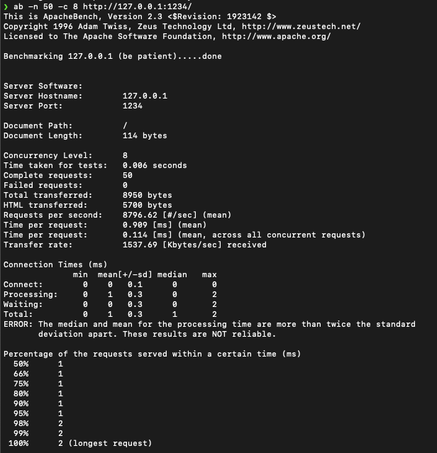

# Concurrent HTTP Server in C

A multithreaded HTTP server written in **pure C**, using **POSIX sockets**, **pthreads**, and a **thread-safe request queue** written from scratch.  


Started with the goal of learning more about systems-level concurrency, synchronization, and low-level network programming.

---

## Features
- **Thread pool** (8 workers) with mutex + condition variable synchronization  
- Handles multiple clients concurrently (producer–consumer design)  
- Serves static files from `static/` directory   

---

## Build

```bash
make
./server
```

## Benchmark Results (ApacheBench)

**Command**
```bash
ab -n 50 -c 8 http://127.0.0.1:1234/
```

Here’s the ApacheBench output confirming concurrency and throughput (~8800 requests/sec with 8 worker threads):




## Future Work 
- MIME type detection (CSS, JS, PNG)  
- Bounded request queue for overload protection  
